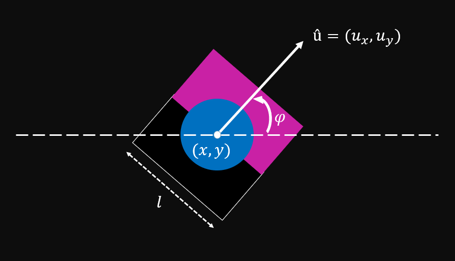
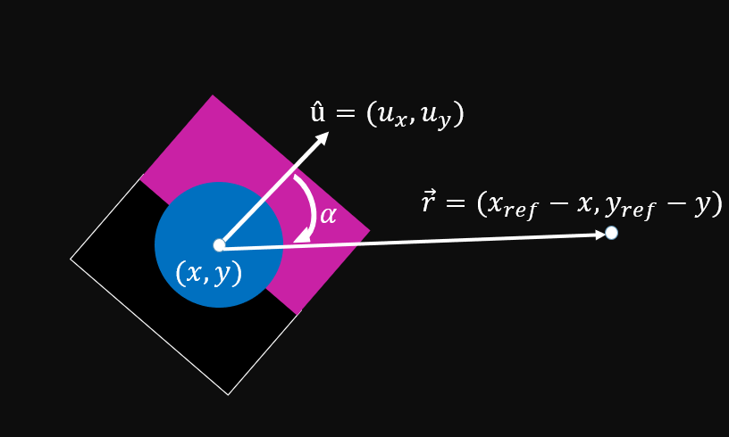

# VSSS Controller Simulator

Pequeno modelo de simulação e controle de um robô da categoria _Very Small Size Soccer_

## Modelo de movimentação

Os eixos que consideramos a movimentação do robô são dados pela figura:

  

As velocidades do robô em cada eixo, relacionadas com as velocidades dos motores _*me*_ e _*md*_
em cm/s (ou m/s) são modeladas por:

No entanto, temos dois pontos a serem levados em conta nesta equação. Ela não é linear, isto é, 
o estado das variáveis depende do seno e do cosseno do ângulo com a horizontal. Além disso, no
processamento de imagem do jogo, o que nos é retornado é o vetor de direção û, de módulo unitário.
Sua relação com o ângulo é precisamente:

de modo com que as velocidades (derivada com o tempo) desses _eixos_ seja associada por:

Por fim, associando com o valor de velocidade angular da primeira equação, 
temos a equação de estados que modela o sistema:

## Modelo de controle

Para controlar os motores _*me*_ e _*md*_, utilizamos um ponto do campo como referência (_setpoint_), que no jogo
pode ser a bola, por exemplo. 

  

Consideramos a função erro, que depende da distância do robô até o _setpoint_ e do
ângulo que û faz com a reta (ou vetor) que liga o centro do robô ao ponto de referência. O objetivo do controle é
zerar esse erro.

## Possíveis melhorias

 - Possívelmente adotar no modelo de movimentação a ideia de aceleração. Deste modo, poderíamos controlar a velocidade com que
o robô chega ao _setpoint_
 - Controlar, além da posição do _setpoint_, o ângulo com que chega ao objetivo.